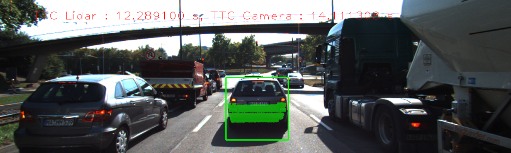

# SFND 3D Object Tracking

Welcome to the final project of the camera course. By completing all the lessons, you now have a solid understanding of keypoint detectors, descriptors, and methods to match them between successive images. Also, you know how to detect objects in an image using the YOLO deep-learning framework. And finally, you know how to associate regions in a camera image with Lidar points in 3D space. Let's take a look at our program schematic to see what we already have accomplished and what's still missing.


In this final project, you will implement the missing parts in the schematic. To do this, you will complete four major tasks: 
1. First, you will develop a way to match 3D objects over time by using keypoint correspondences. 
2. Second, you will compute the TTC based on Lidar measurements. 
3. You will then proceed to do the same using the camera, which requires to first associate keypoint matches to regions of interest and then to compute the TTC based on those matches. 
4. And lastly, you will conduct various tests with the framework. Your goal is to identify the most suitable detector/descriptor combination for TTC estimation and also to search for problems that can lead to faulty measurements by the camera or Lidar sensor. In the last course of this Nanodegree, you will learn about the Kalman filter, which is a great way to combine the two independent TTC measurements into an improved version which is much more reliable than a single sensor alone can be. But before we think about such things, let us focus on your final project in the camera course. 

## Dependencies for Running Locally
* cmake >= 2.8
  * All OSes: [click here for installation instructions](https://cmake.org/install/)
* make >= 4.1 (Linux, Mac), 3.81 (Windows)
  * Linux: make is installed by default on most Linux distros
  * Mac: [install Xcode command line tools to get make](https://developer.apple.com/xcode/features/)
  * Windows: [Click here for installation instructions](http://gnuwin32.sourceforge.net/packages/make.htm)
* Git LFS
  * Weight files are handled using [LFS](https://git-lfs.github.com/)
* OpenCV >= 4.1
  * This must be compiled from source using the `-D OPENCV_ENABLE_NONFREE=ON` cmake flag for testing the SIFT and SURF detectors.
  * The OpenCV 4.1.0 source code can be found [here](https://github.com/opencv/opencv/tree/4.1.0)
* gcc/g++ >= 5.4
  * Linux: gcc / g++ is installed by default on most Linux distros
  * Mac: same deal as make - [install Xcode command line tools](https://developer.apple.com/xcode/features/)
  * Windows: recommend using [MinGW](http://www.mingw.org/)

## Basic Build Instructions

1. Clone this repo.
2. Make a build directory in the top level project directory: `mkdir build && cd build`
3. Compile: `cmake .. && make`
4. Run it: `./3D_object_tracking`


## Result




## Report

#### FP 1. Match 3D Objects

Implement match ech bounding boxs and keypoints. Code : camFusion_Student.cpp line 216 ~244.

```c++
void matchBoundingBoxes(std::vector<cv::DMatch> &matches, std::map<int, int> &bbBestMatches, DataFrame &prevFrame, DataFrame &currFrame)
{
    cv::Mat count_table = cv::Mat::zeros(prevFrame.boundingBoxes.size() , currFrame.boundingBoxes.size(), CV_32S);
    for(cv::DMatch& match_point : matches) {
        const auto& prev_pt = prevFrame.keypoints[match_point.queryIdx].pt;
        const auto& curr_pt = currFrame.keypoints[match_point.trainIdx].pt;
        for(size_t i = 0; i < prevFrame.boundingBoxes.size(); ++i) {
            for(size_t j = 0; j < currFrame.boundingBoxes.size(); ++j) {
                if(prevFrame.boundingBoxes[i].roi.contains(prev_pt) &&  currFrame.boundingBoxes[j].roi.contains(curr_pt)) {
                    count_table.at<int>(i,j)++;
                }
            }
        }
    }
    int best_match_value, best_match_idx;
    for(size_t i = 0; i < count_table.rows; ++i) {
        best_match_value = 0;
        best_match_idx = -1;
        for(size_t j = 0; j < count_table.cols; ++j) {
            if(count_table.at<int>(i,j) > 0 && count_table.at<int>(i,j) > best_match_value){
                best_match_idx = j;
                best_match_value = count_table.at<int>(i,j);
            }
        }
        if(best_match_idx != -1) {
            bbBestMatches.emplace(i, best_match_idx);
        }
    }
}
```


 #### FP 2. Compute Lidar-based TTC

Implement TTC using cropped lidar data. Code : camFusion_Student.cpp line 198 ~213.

```c++
void computeTTCLidar(std::vector<LidarPoint> &lidarPointsPrev,
                     std::vector<LidarPoint> &lidarPointsCurr, double frameRate, double &TTC)
{
    double average_prev_x = 0.0, average_curr_x = 0.0;
    for(auto it=lidarPointsPrev.begin(); it!=lidarPointsPrev.end(); ++it) {
        average_prev_x = average_prev_x + it->x;
    }
    average_prev_x = average_prev_x / lidarPointsPrev.size();

    for(auto it=lidarPointsCurr.begin(); it!=lidarPointsCurr.end(); ++it) {
        average_curr_x = average_curr_x + it->x;
    }
    average_curr_x = average_curr_x / lidarPointsCurr.size();

    TTC = average_curr_x * (1.0 / frameRate) / (average_prev_x - average_curr_x);
}
```


#### FP 3. Associate Keypoint Correspondences with Bounding Boxes

Implement find correspond keypoint from sequential frames. Code : camFusion_Student.cpp line 134 ~154.

```c++
void clusterKptMatchesWithROI(BoundingBox &boundingBox, std::vector<cv::KeyPoint> &kptsPrev, std::vector<cv::KeyPoint> &kptsCurr, std::vector<cv::DMatch> &kptMatches)
{
    float average_distance = 0.0f;
    size_t valid_pt_size = 0;
    for(cv::DMatch& kptMatch : kptMatches) {
        if(boundingBox.roi.contains(kptsCurr[kptMatch.trainIdx].pt)){
            average_distance = average_distance + kptMatch.distance; 
            valid_pt_size++;
        }
    }
    if(valid_pt_size == 0){
        return;
    }
    average_distance = average_distance / valid_pt_size;
    for(cv::DMatch& kptMatch : kptMatches) {
        auto& curr_pt = kptsCurr[kptMatch.trainIdx].pt;
        if(boundingBox.roi.contains(curr_pt) && kptMatch.distance < average_distance) {
            boundingBox.kptMatches.push_back(kptMatch);
        }
    }
}
```


#### FP 4. Compute Camera-based TTC

Implement camera based TTC. Code : camFusion_Student.cpp line 158 ~181.

```c++
void computeTTCCamera(std::vector<cv::KeyPoint> &kptsPrev, std::vector<cv::KeyPoint> &kptsCurr, 
                      std::vector<cv::DMatch> kptMatches, double frameRate, double &TTC, cv::Mat *visImg)
{
    vector<double> distRatios;
    for (auto it1 = kptMatches.begin(); it1 != kptMatches.end() - 1; ++it1)
    {
        cv::KeyPoint kpOuterCurr = kptsCurr.at(it1->trainIdx);
        cv::KeyPoint kpOuterPrev = kptsPrev.at(it1->queryIdx);
        for (auto it2 = kptMatches.begin() + 1; it2 != kptMatches.end(); ++it2)
        {
            double minDist = 100.0; // min. required distance

            cv::KeyPoint kpInnerCurr = kptsCurr.at(it2->trainIdx);
            cv::KeyPoint kpInnerPrev = kptsPrev.at(it2->queryIdx);

            double distCurr = cv::norm(kpOuterCurr.pt - kpInnerCurr.pt);
            double distPrev = cv::norm(kpOuterPrev.pt - kpInnerPrev.pt);
            if (distPrev > std::numeric_limits<double>::epsilon() && distCurr >= minDist)
            {
                double distRatio = distCurr / distPrev;
                distRatios.push_back(distRatio);
            }
        }
    }     

    if (distRatios.size() == 0)
    {
        TTC = NAN;
        return;
    }

    std::sort(distRatios.begin(), distRatios.end());
    long medIndex = floor(distRatios.size() / 2.0);
    double medDistRatio = distRatios.size() % 2 == 0 ? (distRatios[medIndex - 1] + distRatios[medIndex]) / 2.0 : distRatios[medIndex];

    double dT = 1 / frameRate;
    TTC = -dT / (1 - medDistRatio);
}
```

#### FP 5. Performance Evaluation 1 - Reasons of Lidar TTC's Way Off

* Bounding box contains some points which is not involved front car.
* Lidar is not a 100% perfect sensor. This can be also effected by sun light or reflection.
* Lidar-Camera Calibration can be one of the reason. If calibration has some error, bounding box can include wrong points.

#### FP 6. Performance Evaluation 2 - Reasons of Camera TTC's Way Off

* Matching has some false positive.
* Camera distortion is one of the reason.